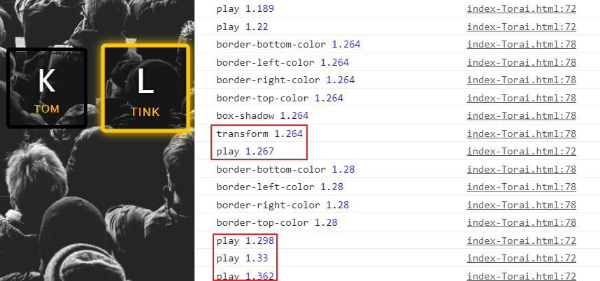

# 01 JavaScript Drum Kit

## 主題：這個練習主要的目的/功能

按下特定的按鍵，播放樂器音效與按鈕放大變亮的效果。

## 步驟：整個範例的建置步驟

1. 監聽 `keydown` 事件，在按下鍵盤後獲得對應的 `keyCode`。
2. 用 querySelector 選取 html 自訂的屬性 `data-key`，加上 `class="playing"`觸發對應的轉場特效。
3. 利用事件代理，在 document 監聽 `transitionend` 事件，transition 結束時把 `class="playing"` 刪掉。

## 語法&備註：紀錄練習中使用到的語法

* > 自訂屬性：[html data-*](https://developer.mozilla.org/zh-TW/docs/Web/HTML/Global_attributes/data-*)、
[HTMLElement.dataset](https://developer.mozilla.org/zh-TW/docs/Web/API/HTMLOrForeignElement/dataset)

  ```HTML
  <div data-key="72" class="key">
      <kbd>H</kbd>
      <span class="sound">ride</span>
  </div>
  ```

* html `<kbd>`：行內元素，標示用戶輸入。
* html [`<audio>`](https://developer.mozilla.org/zh-CN/docs/Web/HTML/Element/audio)：嵌入音頻內容。
* [ES6 template string](https://developer.mozilla.org/zh-TW/docs/Web/JavaScript/Reference/Template_literals)：

  ```JavaScript
    const a = 5
    const b = 10
    console.log(`Fifteen is ${a + b} and
    not ${2 * a + b}.`)
    // fifteen is 15 and
    // not 20.
  ```

* audioElement.play()：播放音訊。
* audioElement.currentTime：目前播放的時間位置。

## 要點：解決問題時的難點

### 鍵盤按鍵與頁面按鈕的對應

對 `keydown` 事件監聽，取得 `event.keyCode` 即是按鍵的 ASCII code（英文字母只對應小寫）。

### 連續按鍵時，中斷音效從頭播放

每次觸發 `keydown`，都把 `audioElement.currentTime` 歸零再 `audioElement.play()` 播放即可。

### 清除頁面按鈕特效

1. `transitionend`事件結束時移除 playing：

    壓住按鍵時，頁面按鈕會閃爍。某些情況下可能會無法移除按鈕特效，見[探索](https://github.com/torai55/JavaScript30/tree/master/01%20-%20JavaScript%20Drum%20Kit#%E6%8E%A2%E7%B4%A2%E5%9C%A8%E7%B7%B4%E7%BF%92%E7%9A%84%E7%AF%84%E4%BE%8B%E4%B8%AD%E6%93%B4%E5%85%85%E6%88%96%E8%AA%BF%E6%95%B4%E8%88%87%E4%B8%BB%E9%A1%8C%E7%9B%B8%E9%97%9C%E7%9A%84%E5%8A%9F%E8%83%BD)。
2. `keyup` 放開按鍵時移除 playing：

    壓住按鍵時，頁面按鈕不會閃爍。

## 探索：在練習的範例中，擴充或調整與主題相關的功能

### 壓著按鍵時 `class="playing"` 會被卡在上面，造成按鈕特效不會被清除

壓著按鍵時，事件觸發順序：

  `keydown`(add playing)→`transitionend`(remove playing)→`keydown`(add playing)  

  
  數字為頁面載入後到事件觸發時的秒數。可以看到觸發 `transitionend` 後在很短的時間（約 0.01s ）內又觸發了 `keydown`(add playing)，導致 transform 下個過場動畫沒有發生，playing 就沒有再被刪除。

  ```JavaScript
    const now = Date.now()
    document.addEventListener('keydown', (e) => {
      const key = document.querySelector(`.key[data-key="${e.keyCode}"]`)
      key.classList.add('playing')
      console.log('play', (Date.now() - now)/1000)
    })

    document.addEventListener('transitionend', (e) => {
      console.log(e.propertyName, (Date.now() - now)/1000)
      // remove playing class
      if (e.propertyName !== 'transform') return
      e.target.classList.remove('playing')
    })
  ```

#### 解決方式

1. 可以從監聽 `transitionend` 改成監聽 `keyup` 事件

    ```JavaScript
      document.addEventListener('keyup', (e) => {
        document.querySelector(`.key[data-key="${e.keyCode}"`).classList.remove('playing')
      })
    ```

2. 把動畫時間改長
3. 把 `e.propertyName !== 'border-bottom-color'` 之類比較早結束的事件。

